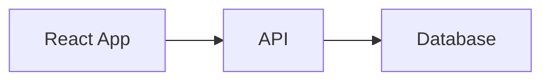

# PIM Documentation with Docusaurus

## 📚 Overview

I've set up a complete **Docusaurus documentation site** for your PIM project. Docusaurus is perfect for your needs because:

- ✅ **React-based** (matches your tech stack)
- ✅ **Markdown + MDX support** (write docs in Markdown with React components)
- ✅ **Open source** (Meta/Facebook project)
- ✅ **Built-in search** (with Algolia integration option)
- ✅ **Versioning support** (for API versions)
- ✅ **Dark mode** included
- ✅ **Mobile responsive** out of the box
- ✅ **Easy to deploy** (GitHub Pages, Vercel, Netlify)

## 🚀 Quick Start

```bash
# Make the script executable
chmod +x /Users/colinroets/dev/projects/product/shell-scripts/start-docs.sh

# Run the documentation
/Users/colinroets/dev/projects/product/shell-scripts/start-docs.sh
```

The documentation will be available at: **http://localhost:3000**

## 📁 Documentation Structure

```
documentation/
├── docs/                 # All your documentation markdown files
│   ├── intro.md         # Homepage
│   ├── quick-start.md   # 5-minute setup guide
│   ├── features/        # Feature documentation
│   │   ├── products.md
│   │   ├── media-library.md  # Complete media docs
│   │   └── categories.md
│   ├── api/            # API documentation
│   │   ├── overview.md # API guide with examples
│   │   └── ...
│   ├── guides/         # User guides
│   └── developers/     # Developer documentation
├── src/
│   ├── pages/         # Custom React pages
│   └── css/           # Custom styling
├── static/            # Static assets (images, etc.)
├── docusaurus.config.ts  # Main configuration
├── sidebars.js        # Sidebar navigation
└── package.json
```

## 📝 Documentation Already Created

I've already created several key documentation pages:

### 1. **Introduction** (`intro.md`)
- Project overview
- Key features
- System requirements
- Architecture diagram

### 2. **Quick Start Guide** (`quick-start.md`)
- 5-minute setup
- Prerequisites
- Step-by-step instructions
- Common commands
- Troubleshooting

### 3. **Media Library Guide** (`features/media-library.md`)
- Complete feature documentation
- Upload methods
- File management
- API endpoints
- Best practices
- Configuration

### 4. **API Overview** (`api/overview.md`)
- Authentication
- Response formats
- Common endpoints
- Rate limiting
- SDK examples (JavaScript, Python, cURL)
- Error codes

## 🎨 Features Configured

### Navigation
- **Top Nav**: Documentation, API, Updates, Swagger link
- **Sidebar**: Organized by category (Getting Started, Features, API, etc.)
- **Footer**: Quick links to all major sections

### Styling
- **Blue theme** matching your PIM brand colors
- **Dark mode** support
- **Responsive** design
- **Code syntax highlighting** for multiple languages

### Search (Ready for Algolia)
- Pre-configured for Algolia DocSearch
- Just add your API keys when ready
- Falls back to basic search until configured

## ➕ Adding New Documentation

### Create a New Page

1. Add a markdown file in the appropriate `docs/` folder:
```markdown
---
sidebar_position: 3
title: Your Page Title
---

# Your Page Title

Your content here...
```

2. The sidebar will automatically update!

### Add Code Examples
````markdown
```typescript
// TypeScript code with syntax highlighting
const example = {
  id: '123',
  name: 'Product'
};
```
````

### Add Diagrams (Mermaid)
````markdown

````

### Add React Components
```jsx
// In .mdx files, you can use React components
<Button onClick={() => alert('Hello!')}>
  Click me!
</Button>
```

## 🚢 Deployment Options

### GitHub Pages
```bash
npm run build
npm run deploy
```

### Vercel
1. Connect your GitHub repo
2. Set build command: `npm run build`
3. Set output directory: `build`

### DigitalOcean (matching your deployment)
1. Build the docs: `npm run build`
2. Serve the `build/` directory with Nginx
3. Configure at `docs.yourdomain.com`

## 📋 Next Steps

1. **Start the documentation**:
   ```bash
   ./shell-scripts/start-docs.sh
   ```

2. **Customize branding**:
   - Replace `/static/img/logo.svg` with your logo
   - Update colors in `/src/css/custom.css`
   - Modify `docusaurus.config.ts` with your URLs

3. **Add more content**:
   - Product management guide
   - Deployment guide for DigitalOcean
   - API endpoint details
   - Video tutorials (embed YouTube/Vimeo)

4. **Enable search**:
   - Apply for free Algolia DocSearch
   - Or implement local search plugin

5. **Set up CI/CD**:
   - Auto-deploy docs on git push
   - Version documentation with releases

## 🔧 Useful Commands

```bash
# Start development server
cd documentation && npm start

# Build for production
cd documentation && npm run build

# Test production build locally
cd documentation && npm run serve

# Clear cache if having issues
cd documentation && npm run clear
```

## 💡 Why Docusaurus?

Compared to alternatives:

| Feature | Docusaurus | GitBook | MkDocs | Readme.io |
|---------|------------|---------|---------|-----------|
| **Open Source** | ✅ Free | ❌ Paid | ✅ Free | ❌ Paid |
| **React-based** | ✅ Yes | ❌ No | ❌ No | ❌ No |
| **MDX Support** | ✅ Yes | ⚠️ Limited | ❌ No | ⚠️ Limited |
| **Customizable** | ✅ Fully | ⚠️ Limited | ✅ Themes | ⚠️ Limited |
| **Search** | ✅ Algolia | ✅ Built-in | ⚠️ Plugin | ✅ Built-in |
| **API Docs** | ✅ Yes | ✅ Yes | ⚠️ Basic | ✅ Excellent |
| **Versioning** | ✅ Yes | ✅ Yes | ⚠️ Manual | ✅ Yes |

## 🎯 Result

You now have a professional documentation site that:
- Matches your tech stack (React/TypeScript)
- Is completely free and open source
- Can be deployed anywhere
- Looks modern and professional
- Is easy to maintain and extend
- Supports all the features you need

Start it up and check it out at **http://localhost:3000**! 🚀
