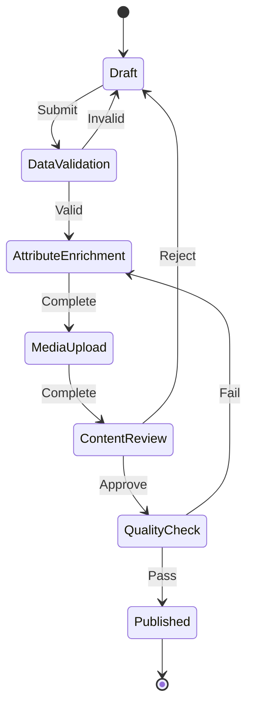
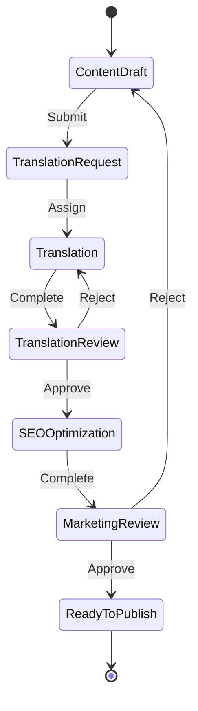
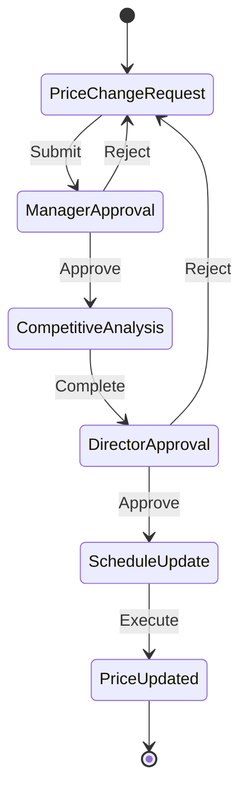

# PIM Workflow Definitions

## Workflow Architecture Overview

The PIM system implements a flexible workflow engine that manages product lifecycle states, approval processes, and task assignments. Workflows ensure data quality and governance through defined stages and transitions.

## Core Workflow Concepts

### Workflow Components

```
┌──────────────┐     ┌──────────────┐     ┌──────────────┐
│    Stage     │────▶│  Transition  │────▶│    Stage     │
└──────────────┘     └──────────────┘     └──────────────┘
       │                     │                    │
       ▼                     ▼                    ▼
┌──────────────┐     ┌──────────────┐     ┌──────────────┐
│    Rules     │     │   Actions    │     │    Rules     │
└──────────────┘     └──────────────┘     └──────────────┘
```

### Stage Types
- **Start**: Initial stage when workflow begins
- **Task**: Requires user action
- **Review**: Requires approval/rejection
- **Gateway**: Conditional branching
- **System**: Automated processing
- **End**: Terminal stage

### Transition Types
- **Manual**: User-initiated
- **Automatic**: Time or condition-based
- **Conditional**: Based on business rules
- **Parallel**: Split to multiple stages
- **Merge**: Converge from multiple stages

## Standard Workflows

### 1. Product Onboarding Workflow

**Purpose**: Validate and enrich new products entering the system.



**Stage Definitions:**

```yaml
workflow: product_onboarding
stages:
  - id: draft
    name: Draft
    type: start
    actions:
      - validate_required_fields
      - check_sku_uniqueness
    transitions:
      - to: data_validation
        action: submit
        conditions:
          - all_required_fields_present
  
  - id: data_validation
    name: Data Validation
    type: system
    auto_transition: true
    actions:
      - validate_attributes
      - check_category_assignment
      - verify_pricing_rules
    transitions:
      - to: draft
        action: reject
        conditions:
          - validation_failed
      - to: attribute_enrichment
        action: approve
        conditions:
          - validation_passed
  
  - id: attribute_enrichment
    name: Attribute Enrichment
    type: task
    assigned_role: data_steward
    sla_hours: 24
    actions:
      - assign_attributes
      - set_attribute_values
      - apply_category_templates
    transitions:
      - to: media_upload
        action: complete
        conditions:
          - required_attributes_filled
  
  - id: media_upload
    name: Media Upload
    type: task
    assigned_role: content_manager
    sla_hours: 48
    actions:
      - upload_primary_image
      - upload_gallery_images
      - generate_thumbnails
    transitions:
      - to: content_review
        action: complete
        conditions:
          - has_primary_image
  
  - id: content_review
    name: Content Review
    type: review
    assigned_role: content_reviewer
    sla_hours: 12
    actions:
      - review_content_quality
      - check_brand_compliance
      - verify_legal_requirements
    transitions:
      - to: draft
        action: reject
        requires_comment: true
      - to: quality_check
        action: approve
  
  - id: quality_check
    name: Quality Check
    type: system
    auto_transition: true
    actions:
      - calculate_completeness_score
      - validate_seo_requirements
      - check_image_quality
    transitions:
      - to: published
        action: pass
        conditions:
          - completeness_score_above_90
      - to: attribute_enrichment
        action: fail
        conditions:
          - completeness_score_below_90
  
  - id: published
    name: Published
    type: end
    actions:
      - index_for_search
      - notify_channels
      - update_audit_log
```

### 2. Content Enrichment Workflow

**Purpose**: Enhance product content with translations and marketing copy.



**Workflow Configuration:**

```json
{
  "id": "content_enrichment",
  "name": "Content Enrichment Workflow",
  "trigger": "manual",
  "stages": [
    {
      "id": "content_draft",
      "name": "Content Draft",
      "type": "start",
      "fields": ["name", "description", "features"],
      "validations": {
        "name": { "minLength": 10, "maxLength": 200 },
        "description": { "minLength": 50, "maxLength": 2000 }
      }
    },
    {
      "id": "translation_request",
      "name": "Translation Request",
      "type": "task",
      "assignedRole": "translation_coordinator",
      "actions": [
        "select_target_locales",
        "set_translation_priority",
        "assign_translators"
      ]
    },
    {
      "id": "translation",
      "name": "Translation",
      "type": "parallel",
      "branches": [
        { "locale": "es", "assignedTo": "spanish_translator" },
        { "locale": "fr", "assignedTo": "french_translator" },
        { "locale": "de", "assignedTo": "german_translator" }
      ],
      "mergeCondition": "all_complete"
    },
    {
      "id": "seo_optimization",
      "name": "SEO Optimization",
      "type": "task",
      "assignedRole": "seo_specialist",
      "tasks": [
        "optimize_meta_title",
        "write_meta_description",
        "add_keywords",
        "create_url_slug"
      ]
    }
  ]
}
```

### 3. Price Update Workflow

**Purpose**: Manage pricing changes with appropriate approvals.



**Business Rules:**

```javascript
// Price change approval rules
const priceApprovalRules = {
  managerApproval: {
    condition: (priceChange) => {
      const percentageChange = 
        ((priceChange.newPrice - priceChange.oldPrice) / priceChange.oldPrice) * 100;
      return Math.abs(percentageChange) <= 10;
    },
    autoApprove: false,
    slaHours: 4
  },
  
  directorApproval: {
    condition: (priceChange) => {
      const percentageChange = 
        ((priceChange.newPrice - priceChange.oldPrice) / priceChange.oldPrice) * 100;
      return Math.abs(percentageChange) > 10;
    },
    autoApprove: false,
    slaHours: 8,
    escalation: {
      after: 12,
      to: 'vp_sales'
    }
  },
  
  competitiveAnalysis: {
    required: true,
    dataPoints: [
      'competitor_pricing',
      'market_average',
      'price_history',
      'demand_forecast'
    ]
  }
};
```

### 4. Product Discontinuation Workflow

**Purpose**: Manage the process of discontinuing products.

```yaml
workflow: product_discontinuation
stages:
  - id: discontinuation_request
    name: Discontinuation Request
    fields:
      - reason: 
          type: select
          options: [low_sales, end_of_life, quality_issues, strategic_decision]
      - replacement_product:
          type: reference
          entity: product
          required: false
      - final_sale_date:
          type: date
          required: true
  
  - id: inventory_review
    name: Inventory Review
    type: task
    assignedRole: inventory_manager
    actions:
      - check_current_stock
      - calculate_sell_through_rate
      - determine_clearance_strategy
  
  - id: channel_notification
    name: Channel Notification
    type: parallel
    branches:
      - notify_ecommerce_channels
      - update_marketplace_listings
      - inform_sales_team
      - notify_customer_service
  
  - id: clearance_execution
    name: Clearance Execution
    type: task
    actions:
      - apply_discount_pricing
      - update_product_status
      - monitor_inventory_levels
  
  - id: final_removal
    name: Final Removal
    type: system
    conditions:
      - inventory_depleted OR final_date_reached
    actions:
      - archive_product
      - remove_from_channels
      - preserve_historical_data
```

## Workflow Engine Implementation

### State Machine Configuration

```typescript
interface WorkflowDefinition {
  id: string;
  name: string;
  version: string;
  stages: StageDefinition[];
  transitions: TransitionDefinition[];
  globalRules: Rule[];
  notifications: NotificationConfig[];
}

interface StageDefinition {
  id: string;
  name: string;
  type: StageType;
  entryActions?: Action[];
  exitActions?: Action[];
  validations?: Validation[];
  sla?: SLAConfig;
  assignment?: AssignmentConfig;
}

interface TransitionDefinition {
  id: string;
  from: string;
  to: string;
  trigger: TriggerType;
  conditions?: Condition[];
  actions?: Action[];
  requiresComment?: boolean;
}
```

### Workflow Service Implementation

```typescript
@Injectable()
export class WorkflowEngine {
  async startWorkflow(
    entityId: string,
    workflowId: string,
    context: WorkflowContext
  ): Promise<WorkflowInstance> {
    const definition = await this.loadWorkflowDefinition(workflowId);
    const instance = await this.createInstance(entityId, definition, context);
    
    // Execute entry actions for initial stage
    await this.executeStageEntry(instance, definition.startStage);
    
    // Schedule automatic transitions
    await this.scheduleAutoTransitions(instance);
    
    return instance;
  }
  
  async transition(
    instanceId: string,
    action: string,
    context: TransitionContext
  ): Promise<TransitionResult> {
    const instance = await this.getInstance(instanceId);
    const currentStage = instance.currentStage;
    
    // Find applicable transition
    const transition = this.findTransition(currentStage, action);
    
    // Evaluate conditions
    if (!await this.evaluateConditions(transition.conditions, context)) {
      throw new WorkflowException('Transition conditions not met');
    }
    
    // Execute transition
    await this.executeTransition(instance, transition, context);
    
    // Update instance state
    await this.updateInstanceState(instance, transition.to);
    
    // Execute entry actions for new stage
    await this.executeStageEntry(instance, transition.to);
    
    return { success: true, newStage: transition.to };
  }
}
```

## Workflow Notifications

### Notification Configuration

```yaml
notifications:
  - trigger: stage_entry
    stage: content_review
    recipients:
      - role: content_reviewer
      - specific: [user@example.com]
    template: content_review_required
    channels: [email, in_app]
  
  - trigger: sla_warning
    threshold: 75  # percentage of SLA consumed
    recipients:
      - assigned_user
      - role: workflow_admin
    template: sla_warning
    channels: [email, slack]
  
  - trigger: stage_completion
    stage: published
    recipients:
      - workflow_initiator
      - role: product_manager
    template: product_published
    channels: [email, webhook]
```

### Notification Templates

```json
{
  "content_review_required": {
    "subject": "Content Review Required: {{product.name}}",
    "body": "A product requires your review:\n\nProduct: {{product.name}}\nSKU: {{product.sku}}\nSubmitted by: {{submitter.name}}\nPriority: {{priority}}\n\nPlease review at: {{review_url}}"
  },
  
  "sla_warning": {
    "subject": "SLA Warning: {{workflow.name}}",
    "body": "Task approaching SLA deadline:\n\nTask: {{stage.name}}\nProduct: {{product.name}}\nTime remaining: {{sla.remaining}}\nAssigned to: {{assignee.name}}"
  }
}
```

## Workflow Analytics

### Key Metrics

```sql
-- Average time per stage
SELECT 
  workflow_id,
  stage_id,
  AVG(EXTRACT(EPOCH FROM (exited_at - entered_at))) as avg_duration_seconds,
  COUNT(*) as completed_count
FROM workflow_history
WHERE exited_at IS NOT NULL
GROUP BY workflow_id, stage_id;

-- Bottleneck identification
SELECT 
  stage_id,
  COUNT(*) as stuck_count,
  AVG(EXTRACT(EPOCH FROM (NOW() - entered_at))) as avg_stuck_duration
FROM product_workflows
WHERE status = 'in_progress'
GROUP BY stage_id
HAVING COUNT(*) > 5
ORDER BY avg_stuck_duration DESC;

-- SLA compliance
SELECT 
  workflow_id,
  stage_id,
  COUNT(*) as total_tasks,
  SUM(CASE WHEN completed_within_sla THEN 1 ELSE 0 END) as met_sla,
  ROUND(100.0 * SUM(CASE WHEN completed_within_sla THEN 1 ELSE 0 END) / COUNT(*), 2) as sla_compliance_percent
FROM workflow_metrics
GROUP BY workflow_id, stage_id;
```

### Dashboard Metrics

```typescript
interface WorkflowMetrics {
  activeWorkflows: number;
  averageCycleTime: Duration;
  stageMetrics: {
    [stageId: string]: {
      averageDuration: Duration;
      currentItems: number;
      slaCompliance: number;
    };
  };
  bottlenecks: {
    stageId: string;
    queueSize: number;
    averageWaitTime: Duration;
  }[];
  throughput: {
    daily: number;
    weekly: number;
    monthly: number;
  };
}
```

## Workflow Customization

### Custom Actions

```typescript
// Register custom action
@WorkflowAction('validate_brand_compliance')
export class ValidateBrandComplianceAction implements IWorkflowAction {
  async execute(context: ActionContext): Promise<ActionResult> {
    const product = context.entity as Product;
    
    // Custom validation logic
    const brandRules = await this.getBrandRules(product.brand);
    const violations = await this.checkCompliance(product, brandRules);
    
    if (violations.length > 0) {
      return {
        success: false,
        errors: violations,
        nextStage: 'brand_correction'
      };
    }
    
    return { success: true };
  }
}
```

### Custom Conditions

```typescript
// Register custom condition
@WorkflowCondition('has_competitive_pricing')
export class HasCompetitivePricingCondition implements IWorkflowCondition {
  async evaluate(context: ConditionContext): Promise<boolean> {
    const product = context.entity as Product;
    const competitorPrices = await this.getCompetitorPrices(product.sku);
    const averagePrice = this.calculateAverage(competitorPrices);
    
    return product.price <= averagePrice * 1.1; // Within 10% of average
  }
}
```

## Workflow Templates

### Quick Start Templates

1. **Simple Approval**: Draft → Review → Published
2. **Two-Stage Approval**: Draft → Manager Review → Director Approval → Published
3. **Content Localization**: Draft → Translation → Review → Published
4. **Quality Assurance**: Import → Validation → Enrichment → QA Check → Published
5. **Seasonal Product**: Planning → Development → Testing → Launch → Active → End of Season

### Industry-Specific Templates

1. **Fashion/Apparel**: Design → Sample → Photography → Copywriting → Merchandising → Published
2. **Electronics**: Specification → Compliance → Testing → Documentation → Marketing → Release
3. **Food & Beverage**: Recipe → Nutrition → Compliance → Packaging → Marketing → Distribution

## Best Practices

### Workflow Design Guidelines

1. **Keep It Simple**: Start with basic workflows and add complexity as needed
2. **Clear Stage Names**: Use descriptive, action-oriented stage names
3. **Defined Responsibilities**: Clearly assign roles and responsibilities
4. **Reasonable SLAs**: Set achievable SLA targets based on historical data
5. **Exception Handling**: Plan for edge cases and exceptions
6. **Audit Trail**: Maintain comprehensive logs for compliance

### Performance Optimization

1. **Async Processing**: Use background jobs for heavy operations
2. **Caching**: Cache workflow definitions and frequently accessed data
3. **Batch Operations**: Process multiple items together when possible
4. **Database Indexing**: Index workflow status and assignment fields
5. **Monitoring**: Track performance metrics and optimize bottlenecks

---
*Last Updated: [Current Date]*
*Version: 1.0*
