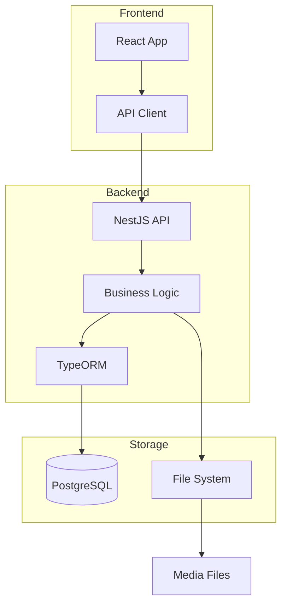

# 🚀 My Engines API Server

Welcome to **My Engines**, a comprehensive Product Information Management (PIM) solution for managing product data, digital assets, and product relationships across your organization.

## What is My Engines?

My Engines is a modern, open-source Product Information Management system built with:
- **Backend**: NestJS (Node.js framework)
- **Frontend**: React with TypeScript
- **Database**: PostgreSQL
- **Media Storage**: Local filesystem with CDN-ready architecture

## Key Features

### 🛍️ **Product Management**
- Complete product lifecycle management
- Support for simple, configurable, bundle, and virtual products
- Product variants and attributes
- SKU management
- Pricing and inventory tracking

### 📸 **Media Library**
- Centralized digital asset management
- Image optimization and thumbnail generation
- Bulk upload capabilities
- Media association with products
- Support for images, videos, and documents

### 📂 **Categories & Attributes**
- Hierarchical category structure
- Flexible attribute system
- Attribute groups and sets
- Dynamic product properties

### 👥 **User Management**
- Role-based access control (RBAC)
- Multi-user support
- Activity tracking
- Secure authentication with JWT

### 🔄 **Import/Export**
- Bulk data operations
- CSV/Excel support
- API integrations
- Data migration tools

## Why Choose My Engines?

1. **Open Source** - No vendor lock-in, full control over your data
2. **Modern Stack** - Built with latest technologies and best practices
3. **Scalable** - Designed to grow with your business
4. **API-First** - RESTful API for easy integrations
5. **Developer Friendly** - Clean code, comprehensive documentation

## Quick Links

- [Quick Start Guide](./quick-start) - Get up and running in 5 minutes
- [Installation](./installation) - Detailed installation instructions
- [API Documentation](./api/overview) - Complete API reference
- [User Guide](./guides/managing-products) - Learn how to use My Engines

## System Requirements

- **Node.js**: v18.0 or higher
- **PostgreSQL**: v14 or higher
- **NPM/Yarn**: Latest version
- **Operating System**: Linux, macOS, or Windows (WSL2)
- **Memory**: Minimum 2GB RAM
- **Storage**: Minimum 10GB for application and media

## Architecture Overview

## Getting Help

- **Documentation**: You're here! 📚
- **API Reference**: [Swagger Docs](http://localhost:3010/api/docs)
- **Issues**: Report bugs on GitHub
- **Community**: Join our discussions

## License

This project is licensed under the MIT License - see the LICENSE file for details.

---

Ready to get started? Head over to the [Quick Start Guide](./quick-start) →
