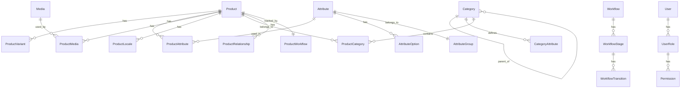

# PIM Domain Model and Database Schema

## Domain Model Overview

The PIM system uses a rich domain model that supports complex product structures, flexible attributes, multi-locale content, and comprehensive workflow management.

## Entity Relationship Diagram



## Core Entities

### Products Domain

#### products
Primary product entity storing base product information.

```sql
CREATE TABLE products (
    id UUID PRIMARY KEY DEFAULT gen_random_uuid(),
    sku VARCHAR(100) UNIQUE NOT NULL,
    type VARCHAR(50) NOT NULL CHECK (type IN ('simple', 'configurable', 'bundle', 'virtual')),
    status VARCHAR(50) NOT NULL DEFAULT 'draft',
    parent_id UUID REFERENCES products(id),
    
    -- Metadata
    created_at TIMESTAMP WITH TIME ZONE DEFAULT CURRENT_TIMESTAMP,
    updated_at TIMESTAMP WITH TIME ZONE DEFAULT CURRENT_TIMESTAMP,
    created_by UUID REFERENCES users(id),
    updated_by UUID REFERENCES users(id),
    version INTEGER DEFAULT 1,
    
    -- Indexing
    INDEX idx_products_sku (sku),
    INDEX idx_products_type (type),
    INDEX idx_products_status (status),
    INDEX idx_products_parent (parent_id)
);
```

#### product_locales
Multi-locale content for products.

```sql
CREATE TABLE product_locales (
    id UUID PRIMARY KEY DEFAULT gen_random_uuid(),
    product_id UUID NOT NULL REFERENCES products(id) ON DELETE CASCADE,
    locale_code VARCHAR(10) NOT NULL,
    
    -- Localized content
    name VARCHAR(255) NOT NULL,
    description TEXT,
    short_description TEXT,
    
    -- SEO fields
    meta_title VARCHAR(255),
    meta_description TEXT,
    meta_keywords TEXT,
    url_key VARCHAR(255),
    
    -- Rich content
    features JSONB,
    specifications JSONB,
    
    created_at TIMESTAMP WITH TIME ZONE DEFAULT CURRENT_TIMESTAMP,
    updated_at TIMESTAMP WITH TIME ZONE DEFAULT CURRENT_TIMESTAMP,
    
    UNIQUE(product_id, locale_code),
    INDEX idx_product_locales_product (product_id),
    INDEX idx_product_locales_locale (locale_code)
);
```

#### product_variants
Product variants for configurable products.

```sql
CREATE TABLE product_variants (
    id UUID PRIMARY KEY DEFAULT gen_random_uuid(),
    parent_product_id UUID NOT NULL REFERENCES products(id) ON DELETE CASCADE,
    variant_product_id UUID NOT NULL REFERENCES products(id) ON DELETE CASCADE,
    
    -- Variant specific data
    variant_attributes JSONB NOT NULL, -- {"color": "red", "size": "M"}
    price_modifier DECIMAL(10,2) DEFAULT 0,
    weight_modifier DECIMAL(10,3) DEFAULT 0,
    
    is_default BOOLEAN DEFAULT FALSE,
    sort_order INTEGER DEFAULT 0,
    
    created_at TIMESTAMP WITH TIME ZONE DEFAULT CURRENT_TIMESTAMP,
    
    UNIQUE(parent_product_id, variant_product_id),
    INDEX idx_variants_parent (parent_product_id),
    INDEX idx_variants_variant (variant_product_id)
);
```

#### product_bundles
Bundle composition for bundle products.

```sql
CREATE TABLE product_bundles (
    id UUID PRIMARY KEY DEFAULT gen_random_uuid(),
    bundle_product_id UUID NOT NULL REFERENCES products(id) ON DELETE CASCADE,
    component_product_id UUID NOT NULL REFERENCES products(id),
    
    quantity INTEGER NOT NULL DEFAULT 1,
    is_required BOOLEAN DEFAULT TRUE,
    sort_order INTEGER DEFAULT 0,
    
    created_at TIMESTAMP WITH TIME ZONE DEFAULT CURRENT_TIMESTAMP,
    
    UNIQUE(bundle_product_id, component_product_id),
    INDEX idx_bundles_bundle (bundle_product_id),
    INDEX idx_bundles_component (component_product_id)
);
```

#### product_relationships
Cross-sell, up-sell, and related product relationships.

```sql
CREATE TABLE product_relationships (
    id UUID PRIMARY KEY DEFAULT gen_random_uuid(),
    source_product_id UUID NOT NULL REFERENCES products(id) ON DELETE CASCADE,
    target_product_id UUID NOT NULL REFERENCES products(id) ON DELETE CASCADE,
    relationship_type VARCHAR(50) NOT NULL CHECK (relationship_type IN ('cross_sell', 'up_sell', 'related', 'accessory')),
    
    sort_order INTEGER DEFAULT 0,
    created_at TIMESTAMP WITH TIME ZONE DEFAULT CURRENT_TIMESTAMP,
    
    UNIQUE(source_product_id, target_product_id, relationship_type),
    INDEX idx_relationships_source (source_product_id),
    INDEX idx_relationships_target (target_product_id),
    INDEX idx_relationships_type (relationship_type)
);
```

### Attributes Domain

#### attributes
Global attribute dictionary.

```sql
CREATE TABLE attributes (
    id UUID PRIMARY KEY DEFAULT gen_random_uuid(),
    code VARCHAR(100) UNIQUE NOT NULL,
    type VARCHAR(50) NOT NULL CHECK (type IN ('text', 'number', 'boolean', 'date', 'select', 'multiselect', 'media', 'price')),
    
    -- Configuration
    is_required BOOLEAN DEFAULT FALSE,
    is_unique BOOLEAN DEFAULT FALSE,
    is_searchable BOOLEAN DEFAULT TRUE,
    is_filterable BOOLEAN DEFAULT FALSE,
    is_comparable BOOLEAN DEFAULT FALSE,
    
    -- Validation
    validation_rules JSONB, -- {"min": 0, "max": 100, "pattern": "^[A-Z]+$"}
    default_value TEXT,
    
    -- Display
    attribute_group_id UUID REFERENCES attribute_groups(id),
    sort_order INTEGER DEFAULT 0,
    
    created_at TIMESTAMP WITH TIME ZONE DEFAULT CURRENT_TIMESTAMP,
    updated_at TIMESTAMP WITH TIME ZONE DEFAULT CURRENT_TIMESTAMP,
    
    INDEX idx_attributes_code (code),
    INDEX idx_attributes_group (attribute_group_id)
);
```

#### attribute_groups
Logical grouping of attributes.

```sql
CREATE TABLE attribute_groups (
    id UUID PRIMARY KEY DEFAULT gen_random_uuid(),
    code VARCHAR(100) UNIQUE NOT NULL,
    name VARCHAR(255) NOT NULL,
    sort_order INTEGER DEFAULT 0,
    
    created_at TIMESTAMP WITH TIME ZONE DEFAULT CURRENT_TIMESTAMP,
    
    INDEX idx_attribute_groups_code (code)
);
```

#### attribute_options
Options for select/multiselect attributes.

```sql
CREATE TABLE attribute_options (
    id UUID PRIMARY KEY DEFAULT gen_random_uuid(),
    attribute_id UUID NOT NULL REFERENCES attributes(id) ON DELETE CASCADE,
    code VARCHAR(100) NOT NULL,
    
    sort_order INTEGER DEFAULT 0,
    is_default BOOLEAN DEFAULT FALSE,
    
    created_at TIMESTAMP WITH TIME ZONE DEFAULT CURRENT_TIMESTAMP,
    
    UNIQUE(attribute_id, code),
    INDEX idx_attribute_options_attribute (attribute_id)
);
```

#### attribute_option_locales
Localized labels for attribute options.

```sql
CREATE TABLE attribute_option_locales (
    id UUID PRIMARY KEY DEFAULT gen_random_uuid(),
    attribute_option_id UUID NOT NULL REFERENCES attribute_options(id) ON DELETE CASCADE,
    locale_code VARCHAR(10) NOT NULL,
    label VARCHAR(255) NOT NULL,
    
    UNIQUE(attribute_option_id, locale_code),
    INDEX idx_option_locales_option (attribute_option_id),
    INDEX idx_option_locales_locale (locale_code)
);
```

#### product_attributes
Product-specific attribute values.

```sql
CREATE TABLE product_attributes (
    id UUID PRIMARY KEY DEFAULT gen_random_uuid(),
    product_id UUID NOT NULL REFERENCES products(id) ON DELETE CASCADE,
    attribute_id UUID NOT NULL REFERENCES attributes(id),
    
    -- Polymorphic value storage
    value_text TEXT,
    value_number DECIMAL(20,6),
    value_boolean BOOLEAN,
    value_date DATE,
    value_datetime TIMESTAMP WITH TIME ZONE,
    value_json JSONB,
    
    -- Multi-value support
    value_options UUID[], -- References to attribute_options
    
    locale_code VARCHAR(10), -- NULL for global attributes
    channel_code VARCHAR(50), -- NULL for global attributes
    
    created_at TIMESTAMP WITH TIME ZONE DEFAULT CURRENT_TIMESTAMP,
    updated_at TIMESTAMP WITH TIME ZONE DEFAULT CURRENT_TIMESTAMP,
    
    UNIQUE(product_id, attribute_id, locale_code, channel_code),
    INDEX idx_product_attributes_product (product_id),
    INDEX idx_product_attributes_attribute (attribute_id),
    INDEX idx_product_attributes_locale (locale_code),
    INDEX idx_product_attributes_channel (channel_code)
);
```

### Categories Domain

#### categories
Hierarchical category tree.

```sql
CREATE TABLE categories (
    id UUID PRIMARY KEY DEFAULT gen_random_uuid(),
    code VARCHAR(100) UNIQUE NOT NULL,
    parent_id UUID REFERENCES categories(id),
    
    -- Tree management (Nested Set Model)
    lft INTEGER NOT NULL,
    rgt INTEGER NOT NULL,
    depth INTEGER NOT NULL DEFAULT 0,
    
    -- Configuration
    is_active BOOLEAN DEFAULT TRUE,
    is_anchor BOOLEAN DEFAULT TRUE, -- Include products from subcategories
    
    -- Display
    sort_order INTEGER DEFAULT 0,
    icon VARCHAR(100),
    image_url TEXT,
    
    created_at TIMESTAMP WITH TIME ZONE DEFAULT CURRENT_TIMESTAMP,
    updated_at TIMESTAMP WITH TIME ZONE DEFAULT CURRENT_TIMESTAMP,
    
    INDEX idx_categories_code (code),
    INDEX idx_categories_parent (parent_id),
    INDEX idx_categories_tree (lft, rgt)
);
```

#### category_locales
Localized category content.

```sql
CREATE TABLE category_locales (
    id UUID PRIMARY KEY DEFAULT gen_random_uuid(),
    category_id UUID NOT NULL REFERENCES categories(id) ON DELETE CASCADE,
    locale_code VARCHAR(10) NOT NULL,
    
    name VARCHAR(255) NOT NULL,
    description TEXT,
    
    -- SEO
    meta_title VARCHAR(255),
    meta_description TEXT,
    meta_keywords TEXT,
    url_key VARCHAR(255),
    
    UNIQUE(category_id, locale_code),
    INDEX idx_category_locales_category (category_id),
    INDEX idx_category_locales_locale (locale_code)
);
```

#### product_categories
Product-to-category associations.

```sql
CREATE TABLE product_categories (
    id UUID PRIMARY KEY DEFAULT gen_random_uuid(),
    product_id UUID NOT NULL REFERENCES products(id) ON DELETE CASCADE,
    category_id UUID NOT NULL REFERENCES categories(id) ON DELETE CASCADE,
    
    is_primary BOOLEAN DEFAULT FALSE,
    sort_order INTEGER DEFAULT 0,
    
    created_at TIMESTAMP WITH TIME ZONE DEFAULT CURRENT_TIMESTAMP,
    
    UNIQUE(product_id, category_id),
    INDEX idx_product_categories_product (product_id),
    INDEX idx_product_categories_category (category_id)
);
```

#### category_attributes
Attributes assigned to categories (inherited by products).

```sql
CREATE TABLE category_attributes (
    id UUID PRIMARY KEY DEFAULT gen_random_uuid(),
    category_id UUID NOT NULL REFERENCES categories(id) ON DELETE CASCADE,
    attribute_id UUID NOT NULL REFERENCES attributes(id),
    
    is_required BOOLEAN DEFAULT FALSE,
    sort_order INTEGER DEFAULT 0,
    
    UNIQUE(category_id, attribute_id),
    INDEX idx_category_attributes_category (category_id),
    INDEX idx_category_attributes_attribute (attribute_id)
);
```

### Media Domain

#### media
Central media/asset repository.

```sql
CREATE TABLE media (
    id UUID PRIMARY KEY DEFAULT gen_random_uuid(),
    
    -- File information
    filename VARCHAR(255) NOT NULL,
    original_name VARCHAR(255) NOT NULL,
    mime_type VARCHAR(100) NOT NULL,
    file_size INTEGER NOT NULL,
    
    -- Storage
    storage_type VARCHAR(50) DEFAULT 'local', -- local, s3, spaces
    storage_path TEXT NOT NULL,
    cdn_url TEXT,
    
    -- Metadata
    width INTEGER,
    height INTEGER,
    duration INTEGER, -- For videos
    metadata JSONB,
    
    -- Processing
    thumbnails JSONB, -- {"small": "path", "medium": "path", "large": "path"}
    processed_versions JSONB,
    
    created_at TIMESTAMP WITH TIME ZONE DEFAULT CURRENT_TIMESTAMP,
    created_by UUID REFERENCES users(id),
    
    INDEX idx_media_mime (mime_type),
    INDEX idx_media_created (created_at)
);
```

#### product_media
Product-to-media associations.

```sql
CREATE TABLE product_media (
    id UUID PRIMARY KEY DEFAULT gen_random_uuid(),
    product_id UUID NOT NULL REFERENCES products(id) ON DELETE CASCADE,
    media_id UUID NOT NULL REFERENCES media(id),
    
    media_type VARCHAR(50) NOT NULL DEFAULT 'image', -- image, video, document, 360
    is_primary BOOLEAN DEFAULT FALSE,
    
    -- Localization
    locale_code VARCHAR(10),
    
    -- Display
    alt_text TEXT,
    title VARCHAR(255),
    sort_order INTEGER DEFAULT 0,
    
    created_at TIMESTAMP WITH TIME ZONE DEFAULT CURRENT_TIMESTAMP,
    
    INDEX idx_product_media_product (product_id),
    INDEX idx_product_media_media (media_id),
    INDEX idx_product_media_type (media_type)
);
```

### Workflow Domain

#### workflows
Workflow definitions.

```sql
CREATE TABLE workflows (
    id UUID PRIMARY KEY DEFAULT gen_random_uuid(),
    code VARCHAR(100) UNIQUE NOT NULL,
    name VARCHAR(255) NOT NULL,
    type VARCHAR(50) NOT NULL, -- product, category, attribute
    
    is_active BOOLEAN DEFAULT TRUE,
    config JSONB,
    
    created_at TIMESTAMP WITH TIME ZONE DEFAULT CURRENT_TIMESTAMP,
    
    INDEX idx_workflows_code (code),
    INDEX idx_workflows_type (type)
);
```

#### workflow_stages
Stages within workflows.

```sql
CREATE TABLE workflow_stages (
    id UUID PRIMARY KEY DEFAULT gen_random_uuid(),
    workflow_id UUID NOT NULL REFERENCES workflows(id) ON DELETE CASCADE,
    code VARCHAR(100) NOT NULL,
    name VARCHAR(255) NOT NULL,
    
    stage_type VARCHAR(50) NOT NULL, -- start, review, approval, published, end
    required_role VARCHAR(100),
    
    sla_hours INTEGER,
    auto_transition_to UUID REFERENCES workflow_stages(id),
    
    sort_order INTEGER DEFAULT 0,
    
    UNIQUE(workflow_id, code),
    INDEX idx_workflow_stages_workflow (workflow_id)
);
```

#### product_workflows
Product workflow state tracking.

```sql
CREATE TABLE product_workflows (
    id UUID PRIMARY KEY DEFAULT gen_random_uuid(),
    product_id UUID NOT NULL REFERENCES products(id) ON DELETE CASCADE,
    workflow_id UUID NOT NULL REFERENCES workflows(id),
    current_stage_id UUID REFERENCES workflow_stages(id),
    
    -- State
    status VARCHAR(50) NOT NULL DEFAULT 'in_progress',
    started_at TIMESTAMP WITH TIME ZONE DEFAULT CURRENT_TIMESTAMP,
    completed_at TIMESTAMP WITH TIME ZONE,
    
    -- Assignment
    assigned_to UUID REFERENCES users(id),
    assigned_at TIMESTAMP WITH TIME ZONE,
    
    -- Tracking
    data JSONB,
    
    INDEX idx_product_workflows_product (product_id),
    INDEX idx_product_workflows_workflow (workflow_id),
    INDEX idx_product_workflows_stage (current_stage_id),
    INDEX idx_product_workflows_assigned (assigned_to)
);
```

#### workflow_history
Audit trail of workflow transitions.

```sql
CREATE TABLE workflow_history (
    id UUID PRIMARY KEY DEFAULT gen_random_uuid(),
    product_workflow_id UUID NOT NULL REFERENCES product_workflows(id) ON DELETE CASCADE,
    
    from_stage_id UUID REFERENCES workflow_stages(id),
    to_stage_id UUID REFERENCES workflow_stages(id),
    
    action VARCHAR(100) NOT NULL,
    comment TEXT,
    
    performed_by UUID REFERENCES users(id),
    performed_at TIMESTAMP WITH TIME ZONE DEFAULT CURRENT_TIMESTAMP,
    
    INDEX idx_workflow_history_product_workflow (product_workflow_id),
    INDEX idx_workflow_history_performed (performed_at)
);
```

### Syndication Domain

#### channels
Distribution channels configuration.

```sql
CREATE TABLE channels (
    id UUID PRIMARY KEY DEFAULT gen_random_uuid(),
    code VARCHAR(100) UNIQUE NOT NULL,
    name VARCHAR(255) NOT NULL,
    type VARCHAR(50) NOT NULL, -- website, marketplace, erp, pos
    
    -- Configuration
    is_active BOOLEAN DEFAULT TRUE,
    config JSONB, -- Channel-specific configuration
    
    -- Locales
    default_locale VARCHAR(10) NOT NULL,
    supported_locales VARCHAR(10)[] NOT NULL,
    
    -- Currency
    default_currency VARCHAR(3) NOT NULL,
    supported_currencies VARCHAR(3)[] NOT NULL,
    
    created_at TIMESTAMP WITH TIME ZONE DEFAULT CURRENT_TIMESTAMP,
    
    INDEX idx_channels_code (code),
    INDEX idx_channels_type (type)
);
```

#### channel_products
Products assigned to channels.

```sql
CREATE TABLE channel_products (
    id UUID PRIMARY KEY DEFAULT gen_random_uuid(),
    channel_id UUID NOT NULL REFERENCES channels(id) ON DELETE CASCADE,
    product_id UUID NOT NULL REFERENCES products(id) ON DELETE CASCADE,
    
    is_published BOOLEAN DEFAULT FALSE,
    published_at TIMESTAMP WITH TIME ZONE,
    
    -- Channel-specific data
    channel_sku VARCHAR(100),
    channel_price DECIMAL(10,2),
    channel_data JSONB,
    
    UNIQUE(channel_id, product_id),
    INDEX idx_channel_products_channel (channel_id),
    INDEX idx_channel_products_product (product_id),
    INDEX idx_channel_products_published (is_published)
);
```

#### exports
Export job tracking.

```sql
CREATE TABLE exports (
    id UUID PRIMARY KEY DEFAULT gen_random_uuid(),
    channel_id UUID REFERENCES channels(id),
    
    type VARCHAR(50) NOT NULL, -- full, delta, manual
    format VARCHAR(50) NOT NULL, -- json, csv, xml
    status VARCHAR(50) NOT NULL DEFAULT 'pending',
    
    -- Filters
    filters JSONB,
    
    -- Results
    total_products INTEGER,
    exported_products INTEGER,
    file_path TEXT,
    error_message TEXT,
    
    started_at TIMESTAMP WITH TIME ZONE,
    completed_at TIMESTAMP WITH TIME ZONE,
    created_by UUID REFERENCES users(id),
    
    INDEX idx_exports_channel (channel_id),
    INDEX idx_exports_status (status),
    INDEX idx_exports_created (started_at)
);
```

### Import Domain

#### imports
Import job tracking.

```sql
CREATE TABLE imports (
    id UUID PRIMARY KEY DEFAULT gen_random_uuid(),
    
    type VARCHAR(50) NOT NULL, -- products, attributes, categories, media
    source VARCHAR(50) NOT NULL, -- file, api, manual
    format VARCHAR(50) NOT NULL, -- csv, json, xml
    
    -- Status
    status VARCHAR(50) NOT NULL DEFAULT 'pending',
    
    -- File
    file_path TEXT,
    file_size INTEGER,
    
    -- Configuration
    mapping_config JSONB,
    options JSONB,
    
    -- Results
    total_rows INTEGER,
    processed_rows INTEGER,
    success_count INTEGER,
    error_count INTEGER,
    warning_count INTEGER,
    
    -- Tracking
    started_at TIMESTAMP WITH TIME ZONE,
    completed_at TIMESTAMP WITH TIME ZONE,
    created_by UUID REFERENCES users(id),
    
    INDEX idx_imports_type (type),
    INDEX idx_imports_status (status),
    INDEX idx_imports_created (started_at)
);
```

#### import_errors
Detailed import error tracking.

```sql
CREATE TABLE import_errors (
    id UUID PRIMARY KEY DEFAULT gen_random_uuid(),
    import_id UUID NOT NULL REFERENCES imports(id) ON DELETE CASCADE,
    
    row_number INTEGER,
    row_data JSONB,
    
    error_type VARCHAR(50) NOT NULL, -- validation, mapping, duplicate, missing
    error_message TEXT NOT NULL,
    field_name VARCHAR(100),
    
    created_at TIMESTAMP WITH TIME ZONE DEFAULT CURRENT_TIMESTAMP,
    
    INDEX idx_import_errors_import (import_id),
    INDEX idx_import_errors_type (error_type)
);
```

### User & Access Domain

#### users
System users.

```sql
CREATE TABLE users (
    id UUID PRIMARY KEY DEFAULT gen_random_uuid(),
    email VARCHAR(255) UNIQUE NOT NULL,
    username VARCHAR(100) UNIQUE NOT NULL,
    
    -- Authentication
    password_hash VARCHAR(255) NOT NULL,
    is_active BOOLEAN DEFAULT TRUE,
    
    -- Profile
    first_name VARCHAR(100),
    last_name VARCHAR(100),
    locale_preference VARCHAR(10) DEFAULT 'en',
    timezone VARCHAR(50) DEFAULT 'UTC',
    
    -- Tracking
    last_login_at TIMESTAMP WITH TIME ZONE,
    created_at TIMESTAMP WITH TIME ZONE DEFAULT CURRENT_TIMESTAMP,
    updated_at TIMESTAMP WITH TIME ZONE DEFAULT CURRENT_TIMESTAMP,
    
    INDEX idx_users_email (email),
    INDEX idx_users_username (username)
);
```

#### roles
Role definitions.

```sql
CREATE TABLE roles (
    id UUID PRIMARY KEY DEFAULT gen_random_uuid(),
    code VARCHAR(100) UNIQUE NOT NULL,
    name VARCHAR(255) NOT NULL,
    description TEXT,
    
    is_system BOOLEAN DEFAULT FALSE,
    
    created_at TIMESTAMP WITH TIME ZONE DEFAULT CURRENT_TIMESTAMP,
    
    INDEX idx_roles_code (code)
);
```

#### user_roles
User-to-role assignments.

```sql
CREATE TABLE user_roles (
    id UUID PRIMARY KEY DEFAULT gen_random_uuid(),
    user_id UUID NOT NULL REFERENCES users(id) ON DELETE CASCADE,
    role_id UUID NOT NULL REFERENCES roles(id) ON DELETE CASCADE,
    
    assigned_at TIMESTAMP WITH TIME ZONE DEFAULT CURRENT_TIMESTAMP,
    assigned_by UUID REFERENCES users(id),
    
    UNIQUE(user_id, role_id),
    INDEX idx_user_roles_user (user_id),
    INDEX idx_user_roles_role (role_id)
);
```

#### permissions
Permission definitions.

```sql
CREATE TABLE permissions (
    id UUID PRIMARY KEY DEFAULT gen_random_uuid(),
    resource VARCHAR(100) NOT NULL,
    action VARCHAR(100) NOT NULL,
    
    UNIQUE(resource, action),
    INDEX idx_permissions_resource (resource)
);
```

#### role_permissions
Role-to-permission assignments.

```sql
CREATE TABLE role_permissions (
    id UUID PRIMARY KEY DEFAULT gen_random_uuid(),
    role_id UUID NOT NULL REFERENCES roles(id) ON DELETE CASCADE,
    permission_id UUID NOT NULL REFERENCES permissions(id) ON DELETE CASCADE,
    
    UNIQUE(role_id, permission_id),
    INDEX idx_role_permissions_role (role_id),
    INDEX idx_role_permissions_permission (permission_id)
);
```

### Audit Domain

#### audit_logs
Comprehensive audit logging.

```sql
CREATE TABLE audit_logs (
    id UUID PRIMARY KEY DEFAULT gen_random_uuid(),
    
    -- Entity tracking
    entity_type VARCHAR(100) NOT NULL,
    entity_id UUID NOT NULL,
    
    -- Action
    action VARCHAR(50) NOT NULL, -- create, update, delete, publish, archive
    
    -- Changes
    old_values JSONB,
    new_values JSONB,
    changed_fields TEXT[],
    
    -- Context
    user_id UUID REFERENCES users(id),
    ip_address INET,
    user_agent TEXT,
    
    created_at TIMESTAMP WITH TIME ZONE DEFAULT CURRENT_TIMESTAMP,
    
    INDEX idx_audit_entity (entity_type, entity_id),
    INDEX idx_audit_user (user_id),
    INDEX idx_audit_created (created_at),
    INDEX idx_audit_action (action)
);
```

## Database Optimization

### Indexes Strategy
- Primary keys: UUID with gen_random_uuid()
- Foreign keys: Indexed for JOIN performance
- Search fields: Full-text search indexes
- Timestamps: Indexed for time-based queries

### Partitioning Strategy
- audit_logs: Monthly partitioning
- import_errors: By import_id hash
- product_attributes: By product_id range (future)

### Performance Considerations
- Use JSONB for flexible schema areas
- Implement database connection pooling
- Regular VACUUM and ANALYZE
- Monitor slow queries with pg_stat_statements

## Migration Strategy

### Phase 1: Core Tables
1. Users, roles, permissions
2. Products, categories, attributes
3. Basic workflows

### Phase 2: Enhanced Features
1. Media management
2. Import/export functionality
3. Audit logging

### Phase 3: Advanced Features
1. Channels and syndication
2. Complex workflows
3. Performance optimizations

---
*Last Updated: [Current Date]*
*Version: 1.0*
